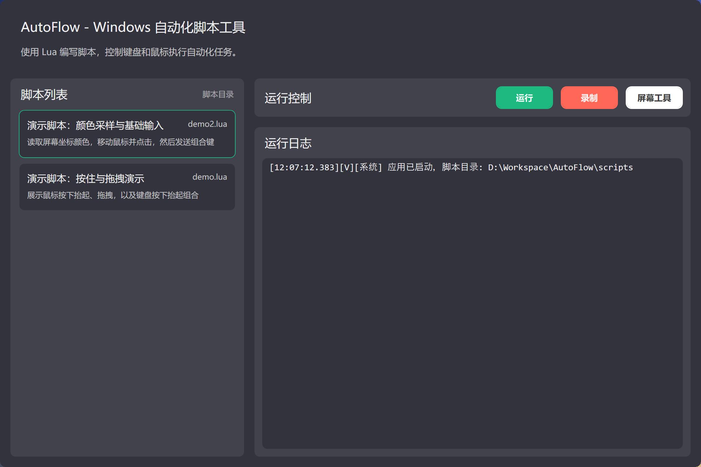

<p align="center">
  
</p>

<h1 align="center">AutoFlow</h1>

<p align="center">
  <strong>Windows 桌面自动化脚本工具</strong>
</p>

<p align="center">
  
  
  
  
</p>



## ✨ 功能亮点

<table>
  <tr>
    <td>🎮 <strong>Lua 脚本驱动</strong></td>
    <td>使用简洁的 Lua 语言编写自动化脚本，支持循环、条件、变量，上手简单</td>
  </tr>
  <tr>
    <td>🖱️ <strong>鼠标控制</strong></td>
    <td>移动、点击、按下/抬起、拖拽，支持左/中/右键</td>
  </tr>
  <tr>
    <td>⌨️ <strong>键盘控制</strong></td>
    <td>单键、组合键（Ctrl/Alt/Shift/Win+）、按下/抬起，覆盖所有常用按键</td>
  </tr>
  <tr>
    <td>🎨 <strong>屏幕取色</strong></td>
    <td>拾取屏幕上任意坐标的颜色值，内置浮窗快捷记录坐标和屏幕取色</td>
  </tr>
  <tr>
    <td>⏺️ <strong>操作录制</strong></td>
    <td>录制键盘和鼠标操作，自动生成可回放的 Lua 脚本</td>
  </tr>
  <tr>
    <td>⚡ <strong>全局快捷键</strong></td>
    <td>自定义快捷键一键运行/停止脚本、开始录制、打开取色器</td>
  </tr>
  <tr>
    <td>📋 <strong>实时日志</strong></td>
    <td>清晰的日志面板，按时间戳、来源、级别显示</td>
  </tr>
  <tr>
    <td>🔔 <strong>系统托盘</strong></td>
    <td>最小化到托盘，气泡通知运行状态，右键菜单快速操作</td>
  </tr>
  <tr>
    <td>🎵 <strong>音效提示</strong></td>
    <td>脚本启动/停止时播放提示音，录制也有声音反馈</td>
  </tr>
  <tr>
    <td>🌑 <strong>深色主题</strong></td>
    <td>简洁现代的深色 GUI，圆角无边框窗口</td>
  </tr>
  <tr>
    <td>📦 <strong>无需安装</strong></td>
    <td>无需安装，解压即用</td>
  </tr>
</table>

## 🚀 快速开始

### 下载运行

从 [Releases](https://github.com/dss886/AutoFlow/releases) 页面下载最新的 `AutoFlow_win-x64.zip`，解压后双击 `AutoFlow.exe` 即可运行。

> 💡 程序第一次运行会在程序同级目录下自动创建 `scripts/` 目录和演示脚本。

### 从源码构建

```powershell
# 克隆仓库
git clone https://github.com/dss886/AutoFlow.git
cd AutoFlow

# 构建项目
dotnet build .\AutoFlow.sln

# 运行
dotnet run --project .\AutoFlow.App\AutoFlow.App.csproj
```

### 打包发布

```powershell
.\publish.ps1 -Configuration Release -Runtime win-x64 -OutputDir publish
```

## 📖 Lua API 参考

### 脚本元数据

在脚本文件开头使用注解声明名称和描述，将显示在脚本列表中：

```lua
-- @name: 我的自动化脚本
-- @description: 自动完成每日任务
```

### `host` - 宿主控制

| API | 说明 |
|-----|------|
| `host.log(message)` | 输出信息到运行日志 |
| `host.sleep(ms)` | 等待指定毫秒数 |

```lua
host.log("脚本开始执行")
host.sleep(500)   -- 等待 500 毫秒
host.log("继续执行")
```

### `mouse` - 鼠标操作

| API | 说明 |
|-----|------|
| `mouse.move(x, y)` | 移动鼠标到屏幕坐标 (x, y) |
| `mouse.click(button)` | 点击鼠标按钮：`"left"` / `"right"` / `"middle"` |
| `mouse.down(button)` | 按下鼠标按钮（不抬起） |
| `mouse.up(button)` | 抬起鼠标按钮 |

```lua
-- 移动并点击
mouse.move(640, 360)
host.sleep(100)
mouse.click("left")

-- 拖拽操作
mouse.move(200, 300)
mouse.down("left")
for i = 1, 10 do
    mouse.move(200 + i * 5, 300)
    host.sleep(50)
end
mouse.up("left")
```

### `keyboard` - 键盘操作

| API | 说明 |
|-----|------|
| `keyboard.press(keys)` | 按下并释放按键，支持组合键（`+` 连接） |
| `keyboard.down(key)` | 按下按键（不释放） |
| `keyboard.up(key)` | 释放按键 |

**支持的按键名称：**

| 类别 | 按键 |
|------|------|
| 字母/数字 | `A` ~ `Z`, `0` ~ `9` |
| 修饰键 | `Ctrl`, `Alt`, `Shift`, `Win` |
| 功能键 | `F1` ~ `F12` |
| 导航键 | `Up`, `Down`, `Left`, `Right` |
| 编辑键 | `Enter`, `Esc`, `Del`, `Ins`, `Back`, `Tab`, `Space` |
| 翻页键 | `PgUp`, `PgDn`, `Home`, `End` |

```lua
-- 单键
keyboard.press("Enter")
keyboard.press("Esc")

-- 组合键
keyboard.press("Ctrl+S")
keyboard.press("Ctrl+Shift+S")
keyboard.press("Alt+Tab")
keyboard.press("Win+R")

-- 按住修饰键后连续输入
keyboard.down("Shift")
host.sleep(100)
keyboard.press("H")
keyboard.press("E")
keyboard.press("L")
keyboard.press("L")
keyboard.press("O")
keyboard.up("Shift")
```

### `screen` - 屏幕取色

| API | 说明 |
|-----|------|
| `screen.get_color(x, y)` | 获取屏幕坐标 (x, y) 处的颜色，返回 `#RRGGBB` 格式 |

```lua
local color = screen.get_color(640, 360)
host.log("坐标 (640, 360) 的颜色是: " .. color)
-- 输出: 坐标 (640, 360) 的颜色是: #FF5733
```

## ⌨️ 全局快捷键

程序在运行时提供全局快捷键，可在系统任何位置触发：

| 快捷键 | 功能 | 可自定义 |
|--------|------|:--------:|
| `F10` | 运行选中的脚本 | ✅ |
| `F11` | 停止当前运行的脚本 | ✅ |
| `F12` | 开始/停止录制操作 | ✅ |
| `Ctrl+Alt+S` | 打开/关闭屏幕取色器 | ✅ |

> 快捷键支持键盘按键和鼠标侧键（XButton1 / XButton2），可在应用设置中自定义。

## 🎨 屏幕取色器

打开取色器后，鼠标位置会出现一个叠加浮层，实时显示：

- 当前鼠标坐标
- 该坐标处的屏幕颜色色块
- 颜色值（支持 Hex / RGB 格式切换）

按下 `R` 键可以记录当前采样颜色，按下 `Shift` 键切换颜色格式。

## ⏺️ 操作录制

录制功能会捕获键盘和鼠标操作，智能合并快速点击，自动处理修饰键组合，最后生成标准的 Lua 脚本文件。

1. 按 `F12`（或点击录制按钮）开始录制，会有 **3 秒倒计时**和音效提示
2. 执行你想要录制的操作
3. 再次按 `F12`（或点击停止按钮）结束录制
4. 录制的脚本会自动保存到 `scripts/` 目录并通过托盘气泡通知

## 📁 项目结构

```
AutoFlow/
├── scripts/                  # Lua 脚本目录（自动监控文件变化）
│   ├── demo.lua              # 演示脚本：颜色采样与基础输入
│   └── demo2.lua             # 演示脚本：按住与拖拽演示
├── AutoFlow.App/             # 主项目
│   ├── Assets/Icons/         # SVG 图标资源
│   ├── Assets/Sounds/        # WAV 音效资源
│   ├── Services/             # 核心服务层（DI 注册）
│   ├── ViewModels/           # MVVM ViewModel
│   ├── Views/Parts/          # 界面组件（脚本列表、日志、控制面板等）
│   ├── Infrastructure/       # 事件总线、RelayCommand
│   ├── Sessions/             # 录制会话
│   ├── Styles/               # WPF 样式
│   ├── Themes/               # 颜色主题
│   └── Models/               # 数据模型
├── AutoFlow.sln              # 解决方案文件
├── publish.ps1               # 发布脚本
└── README.md
```

## 🛠️ 技术栈

| 技术 | 用途 |
|------|------|
| [.NET 8.0](https://dotnet.microsoft.com/) | 运行时和框架 |
| [WPF](https://github.com/dotnet/wpf) | 桌面 GUI 框架 |
| [MoonSharp](https://github.com/moonsharp-devs/moonsharp) | Lua 5.2 解释器（纯 C# 实现） |
| [SharpVectors](https://github.com/ElinamLLC/SharpVectors) | SVG 图标 WPF 渲染 |
| [Microsoft.Extensions.DI](https://www.nuget.org/packages/Microsoft.Extensions.DependencyInjection/) | 依赖注入容器 |
| MVVM + EventBus | 应用架构模式 |

## ⚙️ 配置

本地设置保存在 `%LocalAppData%\AutoFlow\config.json`：
> 除此之外不会在程序目录之外生成其他文件

```json
{
  "WindowLeft": 100,
  "WindowTop": 100,
  "WindowWidth": 800,
  "WindowHeight": 600,
  "RunHotkey": "F10",
  "StopHotkey": "F11",
  "RecordHotkey": "F12",
  "ScreenToolHotkey": "Ctrl+Alt+S",
  "ColorFormat": "Hex"
}
```

## ⚠️ 注意事项

- 自动化输入直接作用于系统前台，运行脚本前请确认目标窗口安全
- 若目标程序以管理员权限运行，本工具也需要以管理员权限运行，否则快捷键可能无法生效
- 部分游戏带有反作弊系统，可能会识别或拦截 `SendInput` 模拟的输入，注意使用风险

## 📄 许可证

本项目基于 [GPLv3 License](LICENSE) 开源。

<p align="center">
  <sub>Made with ❤️ by AutoFlow contributors</sub>
</p>
